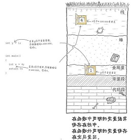

# 

# 内存布局图

 1. ## 在函数中声明的**变量**，计算机会把**变量**保存在栈里。

 2. ## 在函数以外的地方声明**变量**，计算机会把**变量**保存在全局量里

# 变量

> ## 作用域 :
>
> 	- 1.全局变量
> 	- 2.局部变量 ：声明要立马定义。否则会给随机值。
>
> > (**全局变量**)和(**局部变量**)	<同名>	时,使用**局部变量**时,**局部变量**会覆盖全局变量
>
> 
>
> ## 存储方式:
>
> 1.静态变量		2.主动变量		3.寄存器变量

