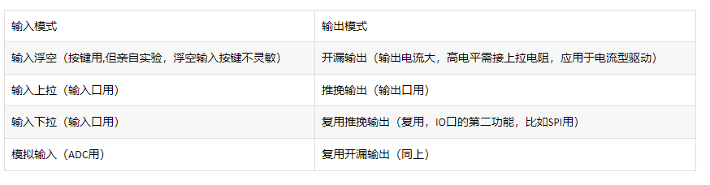
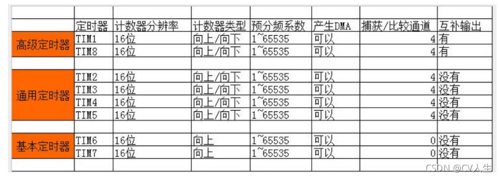

#

# [嵌入式](/_Study/STM32/1/photo.md)

---

# [GPIO外设](_Study\STM32\1\gpio.md)

 

---
---

# [STM32系统内部时钟——SysTick时钟（滴答时钟）](/)

- SysTick定时器包含在M3内核里，捆绑在NVIC 中。

- 它是一款24位倒计数定时器，计数到0时可产生中断。

- 时钟来源可以直接来源于系统时钟，还可以经过8分频之后付给SysTick。

---
---

# [RCC系统时钟](_Study\STM32\1\photo\RCC_CLK.md)

-  从RCC输出的时钟，首先经过AHB总线，分别分配给其他外设时钟，不同的外设挂在不同的桥上。

- 芯片默认上电使用系统内部时钟(8MHz)。经本函数库，默认使用系统外部时钟（72MHz）。

- STM32一共可以有4个晶振源。
  1. 高速内部时钟（HSI），RC振荡器，频率为8MHz。

  2. 高速外部时钟（HSE），可接石英/陶瓷谐振器，或者接外部时钟源，频率范围为4MHz~16MHz。

  3. 低速内部时钟（LSI），RC振荡器，频率为40kHz。

  4. 低速外部时钟（LSE），接频率为32.768kHz的石英晶体。

  5. PLL为锁相环倍频输出，其时钟输入源可选择为HSI/2、HSE或者HSE/2。倍频可选择为2~16倍，但是其输出频率最大不得超过
     72MHz。

---
---

# NVIC ：嵌套向量中断控制器

- 配置外部中断的优先级，如果有多个中断同时响应，
  - 抢占优先级<高>的就会抢占抢占优先级<低>的优先得到执行，

  - 抢占优先级相同时，就比较子优先级。如果抢占优先级和子优先级都相同的话，就比较他们的硬件中断编号，编号越小，优先级越高。

---
---

# [EXTI外部中断 / 事件控制器](_Study\STM32\1\define\exti.md)

- 中断嵌套：中断能够被其他高优先级的中断而中断。

- 优先级：抢占优先级，响应优先级。

- EXTI外部中断，每个IO口都可用来作外部中断。16个外部中断组，所以同时独立使用的外部中断IO口只有16个。

---
---

# [定时器](_Study\STM32\1\define\timer.md)

- 定时器：高级定时器，通用定时器，基本定时器，看门狗定时器，系统滴答定时器...组成。

- 通用定时器的功能：16位向上，向下，向上/向下自动装载计数器。
  1. 16位可编程预分频器，计数器的时钟频率的预分频系数为1~65536之间的任意值。

  2. 4个独立通道，输入捕获，输出比较，PWM生成，单脉冲模式输出。

- 计数器时钟可以由下列时钟源提供:
  1. 内部时钟

  2. 外部时钟1

  3. 外部时钟2

  4. 内壁触发输入。

---
---

# [PWM](_Study\STM32\1\define\pwm.md)

- TIM1.TIM8最多能同时产生7路PWM的输出，TIM2~TIM5等通用定时器能同时产生4路PWM。TIM6和TIM7不能产生PWM。因此STM32最多能同时产生30路的PWM

- 具有重映射功能。

---
---

# [串口通信--USART](_Study\STM32\1\define\usart.md)

- 232串口通信，出现较早，全双工

- 485串口通信，出现较晚，半双工。

- 通用同步异步收发器（URART）利用分数波特率发生器提供宽泛的波特率选择。
  - 支持单向通信，和全，半双工通信。双向通信至少需要两个引脚（RX ：receive，TX : trasport）。
  

---
---

# [ADC](_Study\STM32\1\define\adc.md)

- 12位ADC是一种逐次逼近型的模拟数字转换器，它有多达18个通道，可同时测量16个外部通道，两个内部通道信号源。各通道可以单次，连续，扫描，间断扫描模式执行。ADC的输入时钟不得超过14MHz。

- 16个多路通道，分成规则组，注入组。（类似中断）

- 单次转换（ADC只转换一次），连续转换（ADC转化完成以后，马上进行另一次转换）。

- 模拟看门狗，如果ADC转换的模拟电压低于或者高于阈值,AWD模拟看门狗将会被置位。

- 扫描模式，扫描一组模拟通道。

- 间断模拟。

---
---
